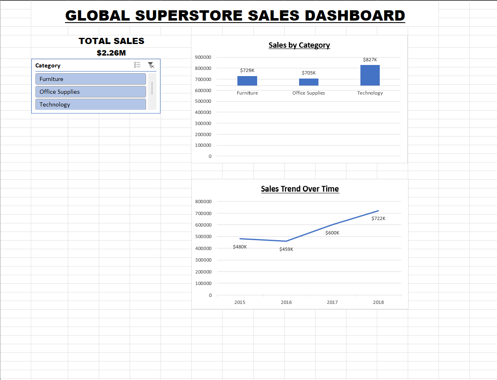

# SCT_DA_1: Interactive Excel Sales Dashboard


## 📌 Project Overview

This project was developed as part of the **Data Analytics Internship at SkillCraft Technology**. 

The goal of **SCT_DA_1** is to analyze the Global Superstore transactional sales dataset using **Microsoft Excel** and create an interactive dashboard to visualize total sales, evaluate product category performance, and track historical sales trends over time.

---

## 🎯 Objectives

* **Data Hygiene & Validation:** Inspect, clean, and validate raw transactional records to ensure data quality and consistency.
* **Aggregations via Pivot Tables:** Structure and summarize 9,800+ sales records across categories and temporal periods.
* **Interactive Visualization:** Build dynamic pivot charts, KPI summary cards, and category slicers.
* **Business Intelligence:** Extract actionable sales insights to evaluate category performance and yearly growth trajectories.
---

## 🛠️ Tools & Excel Features Used

* **Core Software:** Microsoft Excel
* **Data Summarization:** Pivot Tables and Aggregations
* **Visualization:** Clustered Column Charts, Line Charts, and KPI Cards
* **Interactivity:** Dynamic Category Slicers
* **Formatting & UI:** Conditional Formatting (Color Scales), Custom `$K`/`$M` Number Formatting

---
---

## 🖼️ Dashboard Preview



---


## 🧹 Data Validation & Quality Summary

Prior to dashboard creation, rigorous data validation checks were performed on the raw `train.csv` file.

| Metric / Check | Validation Result | Notes |
| :--- | :--- | :--- |
| **Total Rows** | 9,800 | Full dataset preserved |
| **Total Columns** | 18 | Key attributes: Order Date, Category, Sales |
| **Missing Values** | 0 Nulls | Complete dataset |
| **Duplicate Records** | 0 Duplicates | 100% unique row identity |
| **Total Sales** | **$2,261,536.78** | Formatted as **$2.26M** on KPI Cards |
| **Clean Output File** | `Superstore_Sales_Cleaned.xlsx` | Saved separately under `data/cleaned/` |

---

## 📌 Pivot Table Summaries

### 1. Sales by Product Category
| Category | Total Sales ($) | Sales Share (%) |
| :--- | :---: | :---: |
| **Technology** | $827,456 | 36.6% |
| **Furniture** | $728,659 | 32.2% |
| **Office Supplies** | $705,422 | 31.2% |
| **Grand Total** | **$2,261,537** | **100.0%** |

### 2. Yearly Sales Performance Trend
| Year | Total Sales ($) | YoY Growth Trend |
| :--- | :---: | :--- |
| **2015** | $479,856 | Baseline Period |
| **2016** | $459,436 | Slight Dip (-4.2%) |
| **2017** | $600,193 | Strong Recovery (+30.6%) |
| **2018** | $722,052 | **Peak Historical Sales (+20.3%)** |

---

## 💡 Key Business Insights

* **Dominant Category:** **Technology** led all product divisions, generating **~$827.5K** (36.6% of total sales).
* **Balanced Demand:** Furniture (**~$728.7K**) and Office Supplies (**~$705.4K**) maintained consistent sales contributions, ensuring a well-diversified product portfolio.
* **Accelerated Growth:** Sales surged significantly post-2016, culminating in a historical record of **~$722K** in 2018.
* **Data Integrity Note:** The dataset contains (`Sales`) data but does not include explicit Cost, Profit, or Discount fields. Therefore, no unverified profit values or artificial profit margins were introduced.

---

## 🔄 Analytical Workflow

```text
Raw Dataset (train.csv)
       │
       ▼
Data Cleaning & Quality Audit 
       │
       ▼
Structured File (Superstore_Sales_Cleaned.xlsx)
       │
       ▼
Pivot Table Summarization & Aggregations
       │
       ▼
Pivot Charts + KPI Cards + Slicers
       │
       ▼
Interactive Sales Dashboard (Sales_Dashboard.xlsx)
       │
       ▼
Business Intelligence & Reporting
```

---

## 📁 Repository Structure

```text
SCT_DA_1/
│
├── data/
│   ├── raw/
│   │   └── train.csv
│   └── cleaned/
│       └── Superstore_Sales_Cleaned.xlsx
│
├── dashboard/
│   └── Sales_Dashboard.xlsx
│
├── screenshots/
│   └── Sales_Dashboard.png
│
└── README.md
```

---

## 🚀 How to Run & View

1. **Clone the repository:**
  ```bash
   git clone [https://github.com/tyagi-4080/SCT_DA_1.git](https://github.com/tyagi-4080/SCT_DA_1.git)
   cd SCT_DA_1
   ```

2. **Open the Dashboard:**
   * Navigate to the `dashboard/` directory.
   * Open `Sales_Dashboard.xlsx` using **Microsoft Excel**.
   * Interact with the **Category Slicer** to dynamically filter the dashboard by product category.